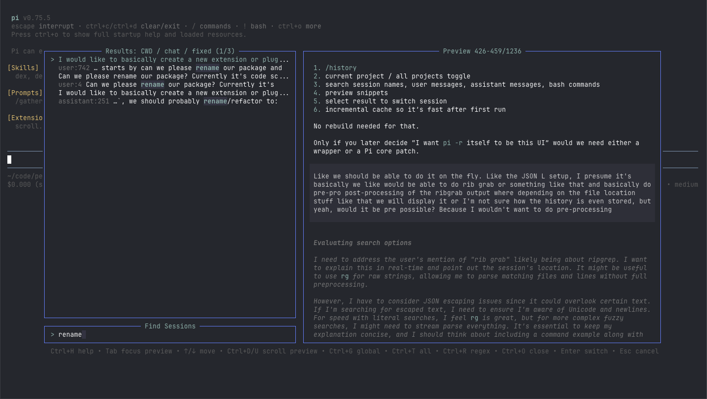

# Pi Scroll

`pi-scroll` is a Pi package that adds `/scroll`: a fast, keyboard-driven search dialog for your Pi session history.

It searches Pi's JSONL session files on demand with ripgrep, shows readable chat-oriented results, renders a rich transcript preview, and switches Pi to the selected session when you press `Enter`.

## Preview



The package gallery image is configured in `package.json` as `pi.image` and uses this screenshot when the package is published.

## Why this exists

Pi sessions accumulate quickly. Once you have more than a handful of projects and branches, remembering the exact session you want to resume becomes painful.

`pi-scroll` is meant to feel like a small Telescope/fuzzy-finder style picker for Pi history:

1. Run `/scroll` inside Pi.
2. Type a phrase you remember from a previous conversation.
3. Search the current project history by default, or toggle all global history.
4. Inspect the session preview without leaving the dialog.
5. Press `Enter` to switch to the selected session.

No persistent index is created. Search happens live against Pi's existing session files.

## Features

- Adds the `/scroll` command.
- Searches Pi JSONL session history with `rg`/ripgrep.
- Defaults to current-project history, with a global-history toggle.
- Filters out noisy tool calls/results by default with an optional `all` mode.
- Supports fixed-string search by default and regex search on demand.
- Shows one best match per session, ranked toward human-readable chat entries.
- Displays session title / first user prompt, cwd metadata, role, line number, and match snippet.
- Skips the currently active session so results focus on sessions you can switch to.
- Shows a rich session preview pane when terminal width allows it.
- Renders previews with Pi-style user, assistant, branch summary, compaction, and tool-result components.
- Loads long previews incrementally and fetches more content as you scroll.
- Supports preview focus and scrolling for longer previews.
- Has built-in help (`Ctrl+H`) with all shortcuts.
- Loads user and project config from `pi-scroll.json` files.

## Installation

Once published to npm, install with Pi:

```bash
pi install npm:pi-scroll
```

Or try it without installing:

```bash
pi -e npm:pi-scroll
```

For local development/testing from this repository:

```bash
pi -e .
```

You can also point directly at the extension file:

```bash
pi -e ./extensions/scroll.ts
```

## Usage

Start Pi with the package enabled, then run:

```text
/scroll
```

Type a search query. Results appear once the query reaches the configured minimum length, which is `2` characters by default.

Press `Enter` on a result to switch Pi to that session.

## Keyboard shortcuts

### Search and filters

| Shortcut            | Action                                                   |
| ------------------- | -------------------------------------------------------- |
| `Ctrl+G`            | Toggle current-project (`CWD`) vs global session history |
| `Ctrl+T`            | Toggle `chat` vs `all` filter mode                       |
| `Ctrl+R` / `Ctrl+S` | Toggle fixed-string vs regex search                      |
| `Ctrl+O`            | Open/close preview                                       |
| `Ctrl+H`            | Toggle help                                              |

### Navigation

| Shortcut            | Action                                                         |
| ------------------- | -------------------------------------------------------------- |
| `Up` / `Down`       | Move through results; scroll preview when preview is focused   |
| `Ctrl+P` / `Ctrl+N` | Move through results; scroll preview when preview is focused   |
| `Tab`               | Focus preview; opens it if needed; press again for results     |
| `Ctrl+D` / `Ctrl+U` | Scroll preview down/up by half a page whenever preview is open |
| `Enter`             | Switch to selected session                                     |
| `Esc`               | Close help or cancel `/scroll`                                 |

### Query editing

| Shortcut            | Action                                               |
| ------------------- | ---------------------------------------------------- |
| `Ctrl+A`            | Move to start of query                               |
| `Ctrl+E`            | Move to end of query                                 |
| `Ctrl+B` / `Ctrl+F` | Move left/right                                      |
| `Alt+B` / `Alt+F`   | Move by word                                         |
| `Ctrl+V` / `Ctrl+W` | Delete word backward                                 |
| `Alt+D`             | Delete word forward                                  |
| `Ctrl+D`            | Delete character under cursor when preview is closed |
| `Ctrl+U` / `Ctrl+K` | Delete to start/end when preview is closed           |

## Preview behavior

The preview is a best-effort transcript view of the selected session. It uses Pi's own rendering components where possible, so messages look closer to the normal transcript than a raw JSON dump.

Preview supports:

- user and assistant messages
- visible assistant thinking/text
- branch summaries and compactions
- compact tool-result cards
- richer tool execution rendering when Pi's TUI context is available
- lazy loading for long or growing session files

For narrow terminals, the preview does not render side-by-side. Press `Tab` to focus the preview as a full-width pane, or `Ctrl+O` to toggle it.

## Search modes

`pi-scroll` has two scope modes:

- `cwd`: search sessions for the current working directory/project.
- `global`: search all Pi sessions under the agent session directory.

It also has two filter modes:

- `chat`: default; searches user messages, assistant text, session names, labels, branch summaries, and compactions while avoiding noisy tool calls/results.
- `all`: includes tool-heavy entries too.

And two search modes:

- `fixed`: default; safe literal matching through ripgrep fixed-string search.
- `regex`: ripgrep regex search.

## Configuration

Defaults live in `src/config.ts`.

User overrides are loaded from:

```text
~/.pi/agent/pi-scroll.json
```

Project overrides are loaded from:

```text
.pi/pi-scroll.json
```

Project config wins over user config.

Example:

```json
{
  "preview": true,
  "defaultScope": "cwd",
  "defaultFilterMode": "chat",
  "defaultSearchMode": "fixed",
  "maxResults": 50
}
```

### Options

| Option                      | Default   | Description                                                              |
| --------------------------- | --------- | ------------------------------------------------------------------------ |
| `preview`                   | `true`    | Whether the preview pane starts open.                                    |
| `previewMinWidth`           | `100`     | Minimum terminal width required for side-by-side preview.                |
| `previewRatio`              | `0.58`    | Fraction of side-by-side width allocated to the preview pane.            |
| `heightRatio`               | `0.8`     | Fraction of terminal height used by the overlay.                         |
| `maxPreviewMessages`        | `18`      | Number of preview entries loaded per lazy-loading batch.                 |
| `maxPreviewCharsPerMessage` | `260`     | Base truncation size used for long user-message preview text.            |
| `defaultScope`              | `"cwd"`   | Initial scope: `"cwd"` or `"global"`.                                    |
| `defaultFilterMode`         | `"chat"`  | Initial filter: `"chat"` or `"all"`.                                     |
| `defaultSearchMode`         | `"fixed"` | Initial search mode: `"fixed"` or `"regex"`.                             |
| `minQueryLength`            | `2`       | Minimum query length before search starts.                               |
| `maxResults`                | `50`      | Maximum result count.                                                    |
| `maxResultTextLength`       | `500`     | Maximum text extracted for each result snippet.                          |
| `ripgrepMaxCount`           | `10`      | Maximum ripgrep matches per file before TypeScript-side scoring.         |
| `navigationWrapQuietMs`     | `180`     | Delay used to avoid accidental wraparound while holding navigation keys. |

## Runtime requirement

`rg`/ripgrep must be available in `PATH`.

On macOS:

```bash
brew install ripgrep
```

## Package structure

The package is exposed to Pi through the `pi` manifest in `package.json`:

```json
{
  "name": "pi-scroll",
  "keywords": ["pi-package"],
  "pi": {
    "extensions": ["./extensions"],
    "image": "https://unpkg.com/pi-scroll@0.1.0/assets/screenshot.png"
  }
}
```

The extension entry point is `extensions/scroll.ts`. The command registered with Pi remains `/scroll`.

## Development

This repo uses Vite+ via `vp`:

```bash
vp install
vp check
vp test
```
